# 软件工程 综合实验报告

<div align="center">

## "智问"——课堂抽问系统

<br/><br/>

| | |
|:---:|:---:|
| **专业名称** | 计算机科学与技术 |
| **班    级** | （请填写） |
| **学    期** | 2025-2026-1 |
| **学    号** | （请填写） |
| **姓    名** | （请填写） |
| **指导教师** | （请填写） |

<br/><br/>

**计算机与信息科学学院 软件学院**

</div>

---

<div align="center">

**综合实验考核成绩：______**

</div>

---

# 目录

- [系统分析说明书（需求规格说明书）](#系统分析说明书需求规格说明书)
  - [1 概述](#1-概述)
  - [2 业务流程分析](#2-业务流程分析)
  - [3 需求](#3-需求)
  - [4 环境](#4-环境)
- [系统设计说明书](#系统设计说明书)
  - [1 概述](#1-概述-1)
  - [2 需求概述](#2-需求概述)
  - [3 总体结构设计](#3-总体结构设计)
  - [4 类的详细设计](#4-类的详细设计)
  - [5 用例实现的详细设计](#5-用例实现的详细设计)
  - [6 数据库设计](#6-数据库设计)
- [课程设计总结](#课程设计总结)

---

# 系统分析说明书（需求规格说明书）

## 1 概述

### 1.1 编写目的

本文档的编写目的是为《智问——课堂抽问系统》项目的开发提供：

a. 软件总体要求，作为用户和软件开发人员之间了解的基础；
b. 功能、性能、接口和可靠性的要求，作为软件人员进行设计和编码的基础；
c. 验收标准，作为用户确认测试的依据。

### 1.2 参考资料

- 《软件工程导论》（第6版） 张海藩
- 《Vue.js 设计与实现》 霍春阳
- Vue.js 3 官方文档 https://vuejs.org/
- Flask 官方文档 https://flask.palletsprojects.com/

### 1.3 术语和缩写词

| 术语/缩写 | 说明 |
|-----------|------|
| Vue | 渐进式 JavaScript 前端框架 |
| Flask | Python 轻量级 Web 框架 |
| API | Application Programming Interface，应用程序编程接口 |
| REST | Representational State Transfer，表现层状态转换 |
| MySQL | 关系型数据库管理系统 |
| CORS | Cross-Origin Resource Sharing，跨域资源共享 |

## 2 业务流程分析

### 2.1 组织机构调查

本系统为课堂抽问系统，用于在课堂场景中，通过随机或指定方式选取学生，完成点名签到与提问互动。系统通过随机或特定算法选择学生回答问题，保证公平性。主要面向高校课堂教学场景，涉及教师角色，教师在课堂上使用本系统进行学生抽问、考勤管理和平时成绩记录。

### 2.2 现行业务流程

**教师活动图：**

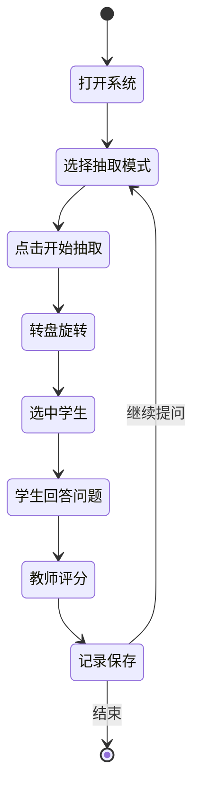

**学生活动图：**

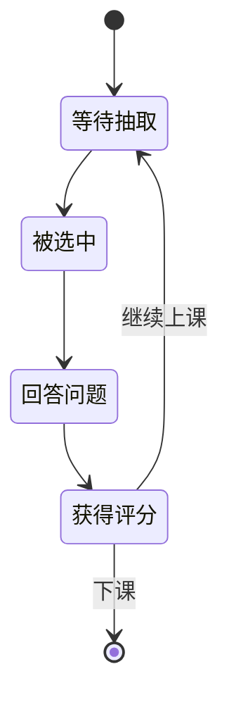

### 2.3 问题分析

公平性问题。
在实现随机抽取功能时，发现完全随机可能导致部分学生被频繁抽中而部分学生很少被点到。这个问题的解决方法是增加"公平模式"，在该模式下系统会统计每位学生的被抽中次数，优先选择次数最少的学生进行抽取。

数据持久化问题。
在开发过程中需要将学生信息和历史记录持久化存储。这个问题的解决方法是使用MySQL数据库，设计students表和selection_history表分别存储学生信息和抽取历史。

## 3 需求

### 3.1 功能需求

用户：教师
功能：添加学生，批量导入学生，删除学生，随机抽取，公平抽取，签到抽取，评分，查看考勤表，导出考勤数据，查看历史记录，清空历史记录。

### 3.2 数据需求

学生信息：学号、姓名、平时分、被抽中次数、考勤状态。
抽取历史：抽取时间、学生信息、抽取模式、评分结果。

**数据类图：**

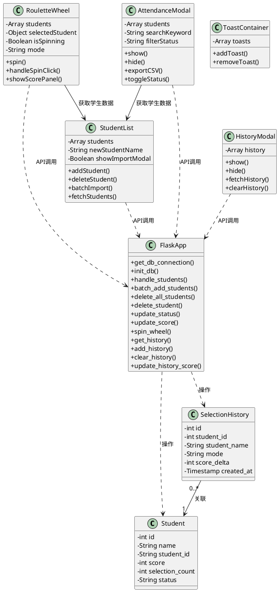

图3-1 数据类图

### 3.3 性能需求

页面加载时间小于2秒，转盘动画流畅无卡顿。

### 3.4 非功能需求

本系统界面简洁美观，支持主流浏览器使用。

## 4 环境

### 4.1 运行环境

Windows 7 及以上系统版本，安装有现代浏览器（Chrome、Firefox等）。

### 4.2 开发环境

前端：Vue.js 3.5.24、Vite 7.2.4
后端：Flask 3.1.2、Python 3.14
数据库：MySQL 8.0
开发工具：VS Code

---

# 系统设计说明书

## 1 概述

### 1.1 编写目的

本文档的编写目的是：详细定义《智问——课堂抽问系统》软件的总体功能；给出系统的结构设计和过程设计，作为程序编写的依据。

### 1.2 参考资料

- 《软件工程导论》（第6版） 张海藩
- 《Vue.js 设计与实现》 霍春阳
- Vue.js 3 官方文档 https://vuejs.org/
- Flask 官方文档 https://flask.palletsprojects.com/

## 2 需求概述

本系统是一个面向课堂教学场景的学生抽问工具，主要实现转盘抽取、学生管理、考勤管理、历史记录等功能。（详细说明见《系统分析说明书》）

## 3 总体结构设计

### 3.1 内部结构设计

1. 前端界面由以下部分组成：
<1> 转盘组件RouletteWheel.vue：负责展示可视化转盘和旋转动画。
<2> 学生列表组件StudentList.vue：负责学生的添加、删除、批量导入和展示。
<3> 考勤模态框AttendanceModal.vue：负责考勤表的查看、筛选和导出。
<4> 历史模态框HistoryModal.vue：负责抽取历史的查看和清空。

2. 后端逻辑处理：
<1> API路由层：接收前端请求，进行参数校验。
<2> 业务逻辑层：处理抽取算法、评分计算等业务逻辑。
<3> 数据访问层：通过PyMySQL连接MySQL数据库。

本系统采用前后端分离的三层架构，如图

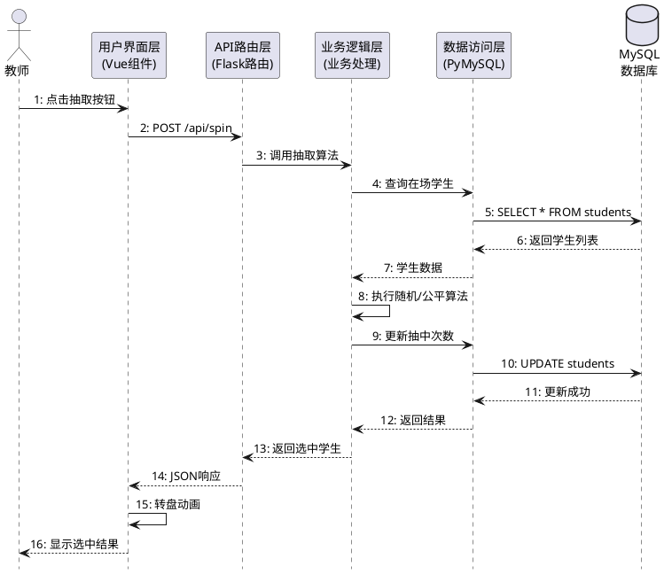

图3-1 三层架构时序图

3. 状态图：

**教师操作状态图**

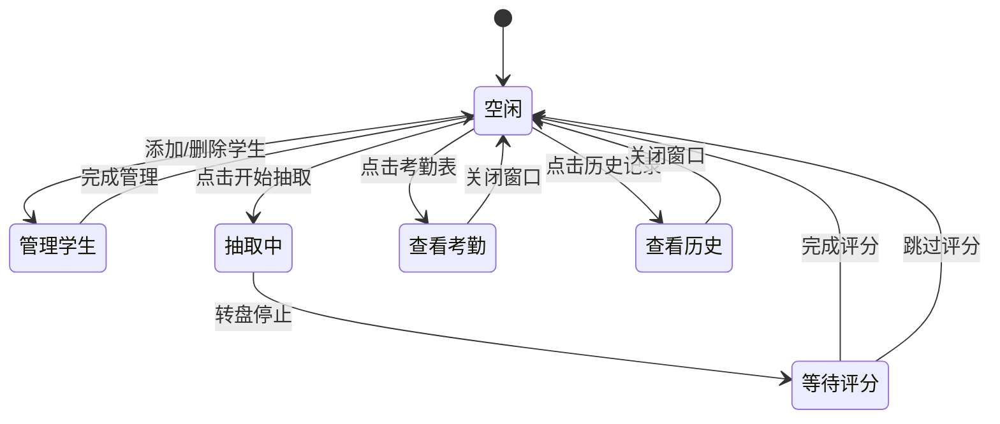

图3-2 教师操作状态图

**抽取流程状态图**

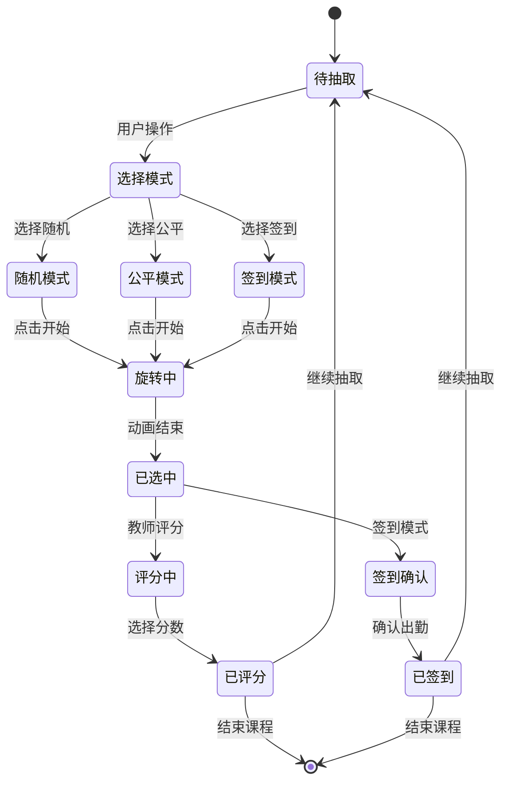

图3-3 抽取流程状态图

**学生考勤状态图**

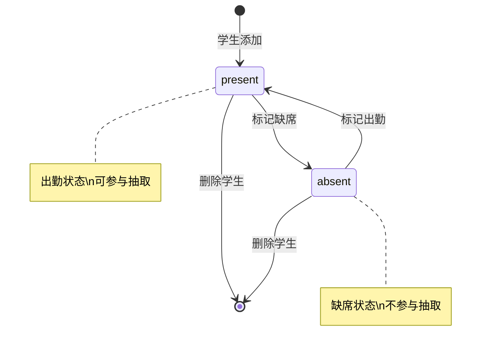

图3-4 学生考勤状态图

## 4 类的详细设计

### 4.1 Student类

#### 4.1.1 描述
Student类主要描述了学生的属性和行为

#### 4.1.2 属性
id：学生ID
name：学生姓名
student_id：学号
score：平时分
selection_count：被抽中次数
status：考勤状态

#### 4.1.3 公有方法

getStudents：
```python
@app.route('/api/students', methods=['GET'])
def get_students():
    cursor.execute('SELECT * FROM students')
    students = cursor.fetchall()
    return jsonify(students)
```

addStudent：
```python
@app.route('/api/students', methods=['POST'])
def add_student():
    name = request.json.get('name')
    student_id = request.json.get('student_id')
    cursor.execute('INSERT INTO students (name, student_id, status) VALUES (%s, %s, %s)', 
                   (name, student_id, 'present'))
    conn.commit()
    return jsonify({'message': 'Student added'}), 201
```

updateScore：
```python
@app.route('/api/students/<int:id>/score', methods=['PUT'])
def update_score(id):
    delta = request.json.get('delta', 0)
    cursor.execute('UPDATE students SET score = score + %s WHERE id = %s', (delta, id))
    conn.commit()
    return jsonify({'message': 'Score updated'}), 200
```

### 4.2 SelectionHistory类

#### 4.2.1 描述
SelectionHistory类主要描述了抽取历史记录的属性和行为

#### 4.2.2 属性
id：记录ID
student_id：学生ID
student_name：学生姓名
mode：抽取模式
score_delta：评分变化
created_at：创建时间

#### 4.2.3 公有方法

getHistory：
```python
@app.route('/api/history', methods=['GET'])
def get_history():
    cursor.execute('SELECT * FROM selection_history ORDER BY created_at DESC LIMIT 100')
    history = cursor.fetchall()
    return jsonify(history)
```

addHistory：
```python
@app.route('/api/history', methods=['POST'])
def add_history():
    student_id = request.json.get('student_id')
    student_name = request.json.get('student_name')
    mode = request.json.get('mode', 'random')
    score_delta = request.json.get('score_delta', 0)
    cursor.execute('INSERT INTO selection_history (student_id, student_name, mode, score_delta) VALUES (%s, %s, %s, %s)',
                   (student_id, student_name, mode, score_delta))
    conn.commit()
    return jsonify({'message': 'History added'}), 201
```

clearHistory：
```python
@app.route('/api/history', methods=['DELETE'])
def clear_history():
    cursor.execute('DELETE FROM selection_history')
    conn.commit()
    return jsonify({'message': 'History cleared'}), 200
```

## 5 用例实现的详细设计

### 5.1 抽取学生用例

| 用例名称 | 抽取学生 |
|----------|----------|
| 参与者 | 教师 |
| 用例描述 | 教师在"智问课堂抽问系统"中抽取学生回答问题 |
| 前置条件 | 教师已进入系统主界面，系统中存在至少一名出勤学生 |
| 后置条件 | 数据库更新学生被抽中次数，历史记录新增一条 |
| 基本事件流 | 1. 教师选择抽取模式（随机/公平）<br>2. 教师点击转盘中心"开始"按钮<br>3. 系统开始转盘旋转动画<br>4. 系统根据模式选择学生<br>5. 转盘停止，显示被选中学生姓名<br>6. 教师对学生回答进行评分<br>7. 系统更新学生分数并记录历史 |
| 备选事件流 | 4a. 如果无出勤学生，系统提示"无可抽取学生"<br>6a. 如果教师不评分，系统记录评分为空 |
| 补充说明 | 公平模式优先选择被抽中次数少的学生 |

表5-1 抽取学生用例规约

抽取学生活动图如下：

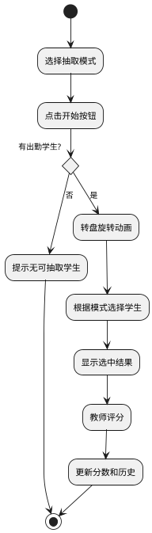

图5-1 抽取学生活动图

**交互设计：**
1. 教师点击"开始"按钮，前端触发spin事件
2. 前端发送POST请求到后端接口 `/api/spin`，携带mode参数
3. 后端从MySQL数据库查询状态为"present"的学生列表
4. 后端根据模式（random/fair）执行选择算法，更新学生的selection_count字段
5. 后端返回被选中学生的JSON数据
6. 前端接收数据，执行转盘旋转动画，停在对应位置
7. 教师点击评分按钮，前端发送PUT请求到 `/api/students/{id}/score` 更新分数
8. 前端发送POST请求到 `/api/history` 记录本次抽取

### 5.2 添加学生用例

| 用例名称 | 添加学生 |
|----------|----------|
| 参与者 | 教师 |
| 用例描述 | 教师在"智问课堂抽问系统"中添加学生 |
| 前置条件 | 教师已进入系统主界面 |
| 后置条件 | 数据库新增学生记录 |
| 基本事件流 | 1. 教师输入学生姓名<br>2. 教师点击"添加"按钮<br>3. 系统将学生信息存入数据库<br>4. 系统显示"添加成功"提示<br>5. 学生列表刷新 |
| 备选事件流 | 2a. 如果姓名为空，系统不执行操作 |
| 补充说明 | 无 |

表5-2 添加学生用例规约

添加学生活动图如下：

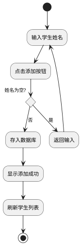

图5-2 添加学生活动图

**交互设计：**
1. 教师在输入框输入学生姓名，点击"添加"按钮
2. 前端验证姓名非空后，发送POST请求到后端接口 `/api/students`
3. 后端接收数据，执行INSERT语句将学生信息插入MySQL数据库
4. 后端返回新增学生的完整信息（含自增ID）
5. 前端接收响应，显示Toast提示"添加成功"
6. 前端重新发送GET请求到 `/api/students` 获取最新学生列表并刷新显示

### 5.3 批量导入用例

| 用例名称 | 批量导入学生 |
|----------|----------|
| 参与者 | 教师 |
| 用例描述 | 教师在"智问课堂抽问系统"中批量导入学生名单 |
| 前置条件 | 教师已进入系统主界面 |
| 后置条件 | 数据库新增多条学生记录 |
| 基本事件流 | 1. 教师点击"导入"按钮<br>2. 系统弹出导入窗口<br>3. 教师粘贴学生名单<br>4. 教师点击"确认导入"<br>5. 系统解析并存入数据库<br>6. 系统显示导入结果<br>7. 弹窗关闭，列表刷新 |
| 备选事件流 | 4a. 如果文本框为空，系统提示"请输入学生名单" |
| 补充说明 | 支持格式：仅姓名 或 学号+空格+姓名 |

表5-3 批量导入用例规约

批量导入活动图如下：

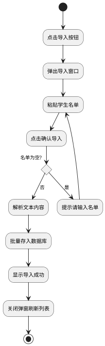

图5-3 批量导入活动图

**交互设计：**
1. 教师点击"导入"按钮，前端弹出导入模态框
2. 教师粘贴学生名单，点击"确认导入"
3. 前端解析文本，按行分割，提取姓名和学号
4. 前端发送POST请求到后端接口 `/api/students/batch`，携带学生数组
5. 后端遍历数组，批量执行INSERT语句插入MySQL数据库
6. 后端返回成功导入的学生数量
7. 前端关闭模态框，显示Toast提示"成功导入N名学生"
8. 前端刷新学生列表

### 5.4 删除学生用例

| 用例名称 | 删除学生 |
|----------|----------|
| 参与者 | 教师 |
| 用例描述 | 教师在"智问课堂抽问系统"中删除学生 |
| 前置条件 | 教师已进入系统主界面，学生列表中存在学生 |
| 后置条件 | 数据库删除对应学生记录 |
| 基本事件流 | 1. 教师点击学生后的"×"按钮<br>2. 系统弹出确认对话框<br>3. 教师确认删除<br>4. 系统从数据库删除学生<br>5. 系统显示"删除成功"<br>6. 学生列表刷新 |
| 备选事件流 | 3a. 如果教师点击取消，关闭对话框，不执行删除 |
| 补充说明 | 无 |

表5-4 删除学生用例规约

删除学生活动图如下：

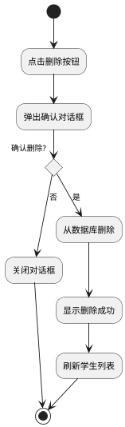

图5-4 删除学生活动图

**交互设计：**
1. 教师点击学生项后的"×"按钮
2. 前端弹出确认对话框，询问是否删除
3. 教师点击"确认"，前端发送DELETE请求到后端接口 `/api/students/{id}`
4. 后端执行DELETE语句从MySQL数据库删除对应记录
5. 后端返回删除成功的响应
6. 前端关闭对话框，显示Toast提示"学生已删除"
7. 前端从本地学生列表中移除该学生，刷新显示

### 5.5 查看考勤表用例

| 用例名称 | 查看考勤表 |
|----------|----------|
| 参与者 | 教师 |
| 用例描述 | 教师在"智问课堂抽问系统"中查看班级考勤情况 |
| 前置条件 | 教师已进入系统主界面 |
| 后置条件 | 无 |
| 基本事件流 | 1. 教师点击"考勤表"按钮<br>2. 系统弹出考勤表窗口<br>3. 系统显示所有学生的考勤状态<br>4. 系统显示统计信息 |
| 备选事件流 | 3a. 教师可搜索学生<br>3b. 教师可按状态筛选 |
| 补充说明 | 统计信息包括：应到、实到、缺席、出勤率 |

表5-5 查看考勤表用例规约

查看考勤表活动图如下：

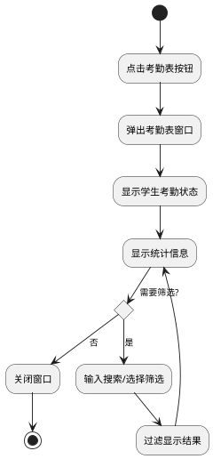

图5-5 查看考勤表活动图

**交互设计：**
1. 教师点击"考勤表"按钮，前端弹出考勤表模态框
2. 前端从已加载的students数据中渲染考勤表格
3. 前端计算统计信息：应到人数、实到人数、缺席人数、出勤率
4. 教师输入搜索关键词或选择筛选条件
5. 前端在本地对students数据进行过滤，重新渲染表格
6. 教师关闭模态框，返回主界面

### 5.6 导出考勤数据用例

| 用例名称 | 导出考勤数据 |
|----------|----------|
| 参与者 | 教师 |
| 用例描述 | 教师在"智问课堂抽问系统"中导出考勤表为CSV文件 |
| 前置条件 | 教师已打开考勤表窗口 |
| 后置条件 | 生成CSV文件并下载到本地 |
| 基本事件流 | 1. 教师点击"导出表格"按钮<br>2. 系统弹出列选择窗口<br>3. 教师勾选要导出的列<br>4. 教师点击"确认导出"<br>5. 系统生成CSV文件<br>6. 浏览器自动下载文件 |
| 备选事件流 | 3a. 默认勾选：系统ID、学号、姓名、状态 |
| 补充说明 | 无 |

表5-6 导出考勤数据用例规约

导出考勤数据活动图如下：

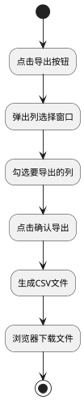

图5-6 导出考勤数据活动图

**交互设计：**
1. 教师在考勤表模态框中点击"导出表格"按钮
2. 前端弹出列选择窗口，显示可导出的列选项
3. 教师勾选要导出的列，点击"确认导出"
4. 前端根据勾选的列，从students数据中提取对应字段
5. 前端将数据转换为CSV格式字符串
6. 前端创建Blob对象和下载链接，触发浏览器下载
7. 文件以"考勤表_日期.csv"命名保存到本地

### 5.7 查看历史记录用例

| 用例名称 | 查看历史记录 |
|----------|----------|
| 参与者 | 教师 |
| 用例描述 | 教师在"智问课堂抽问系统"中查看抽取历史 |
| 前置条件 | 教师已进入系统主界面 |
| 后置条件 | 无 |
| 基本事件流 | 1. 教师点击"历史记录"按钮<br>2. 系统弹出历史记录窗口<br>3. 系统显示所有抽取记录<br>4. 每条记录包含：时间、学生、模式、评分 |
| 备选事件流 | 4a. 教师可点击"清空记录"删除所有历史 |
| 补充说明 | 无 |

表5-7 查看历史记录用例规约

查看历史记录活动图如下：

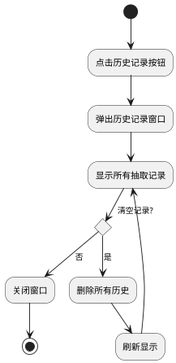

图5-7 查看历史记录活动图

**交互设计：**
1. 教师点击"历史记录"按钮，前端弹出历史记录模态框
2. 前端发送GET请求到后端接口 `/api/history`
3. 后端执行SELECT语句从MySQL数据库查询selection_history表
4. 后端返回历史记录列表（按时间倒序）
5. 前端渲染历史记录表格，显示时间、学生、模式、评分
6. 若教师点击"清空记录"，前端发送DELETE请求到 `/api/history`
7. 后端执行DELETE语句清空selection_history表
8. 前端刷新显示，表格变为空

## 6 数据库设计

对程序当中所采用的数据库相关规格说明等进行定义。数据库表结构的数据类型符合MySQL规定。

**表1：students表**

students表用于存储学生的基本信息和课堂表现数据。每个学生对应一条记录，记录学生的姓名、学号、平时分、被抽中次数以及当前考勤状态。

| 字段名 | 类型 | 长度 | 是否为空 | 主键 | 默认值 | 说明 |
|--------|------|------|----------|------|--------|------|
| id | INT | 11 | NOT NULL | 是 | AUTO_INCREMENT | 主键，自增 |
| name | VARCHAR | 100 | NOT NULL | 否 | - | 学生姓名 |
| student_id | VARCHAR | 50 | NULL | 否 | NULL | 学号 |
| score | INT | 11 | NULL | 否 | 0 | 平时分 |
| selection_count | INT | 11 | NULL | 否 | 0 | 被抽中次数 |
| status | VARCHAR | 20 | NULL | 否 | 'present' | 状态(present/absent) |

表6-1 students表

**表2：selection_history表**

selection_history表用于记录每次抽取的历史信息。每次抽取学生后，系统会在此表中插入一条记录，包含被抽中的学生、抽取模式、评分结果和时间，便于教师查看和统计。

| 字段名 | 类型 | 长度 | 是否为空 | 主键 | 默认值 | 说明 |
|--------|------|------|----------|------|--------|------|
| id | INT | 11 | NOT NULL | 是 | AUTO_INCREMENT | 主键，自增 |
| student_id | INT | 11 | NULL | 否 | NULL | 关联学生ID |
| student_name | VARCHAR | 100 | NULL | 否 | NULL | 学生姓名（冗余） |
| mode | VARCHAR | 20 | NULL | 否 | NULL | 抽取模式 |
| score_delta | INT | 11 | NULL | 否 | NULL | 评分变化值 |
| created_at | TIMESTAMP | - | NULL | 否 | CURRENT_TIMESTAMP | 创建时间 |

表6-2 selection_history表

**建表SQL语句：**

```sql
-- 创建学生表
CREATE TABLE IF NOT EXISTS students (
    id INT(11) AUTO_INCREMENT PRIMARY KEY,
    name VARCHAR(100) NOT NULL,
    student_id VARCHAR(50) DEFAULT NULL,
    score INT(11) DEFAULT 0,
    selection_count INT(11) DEFAULT 0,
    status VARCHAR(20) DEFAULT 'present'
) ENGINE=InnoDB DEFAULT CHARSET=utf8mb4 COLLATE=utf8mb4_unicode_ci;

-- 创建历史记录表
CREATE TABLE IF NOT EXISTS selection_history (
    id INT(11) AUTO_INCREMENT PRIMARY KEY,
    student_id INT(11) DEFAULT NULL,
    student_name VARCHAR(100) DEFAULT NULL,
    mode VARCHAR(20) DEFAULT NULL,
    score_delta INT(11) DEFAULT NULL,
    created_at TIMESTAMP DEFAULT CURRENT_TIMESTAMP
) ENGINE=InnoDB DEFAULT CHARSET=utf8mb4 COLLATE=utf8mb4_unicode_ci;
```

---

# 课程设计总结

## 1 课程设计目的

通过这次的课程设计，我提高了软件工程分析与设计的能力。通过课程设计，我掌握了软件系统规划、分析与设计的基本方法，培养了运用软件工程的工具与技术解决系统规划、分析、设计、实施以及运行维护中的实际问题的能力。

## 2 课程设计完成情况

a. 前期的课程设计内容分析：确定开发《智问——课堂抽问系统》
b. 对《智问——课堂抽问系统》进行需求分析与总体设计
c. 完成前后端代码的编写与调试
d. 完成系统测试与文档撰写

## 3 个人总结

| 学号 | 222023321102116 | 姓名 | 郭艺煊 |
|:---:|:---:|:---:|:---:|

**工作总结：**

软件工程是一门操作性很强的课程，通过这次的课程设计，将我所学的东西应用到实际中，做到学以致用；不仅如此，我还应用到了我所感兴趣的方面。

在设计的过程中，我不断思考如何让系统更加实用、方便，真正做到了以用户为中心。

软件工程的系统分析与设计，是开发一个成功系统的前提。通过课程设计，我深刻地了解了分析的重要性。

在这次的课程设计上，我主要负责转盘抽取部分的设计。将抽取划分为不同的模式（随机模式、公平模式）可以使教师更为灵活地进行课堂提问，换而言之，就是可以更好地为教学服务。

在开发过程中虽然遇到了许许多多的问题，但是通过查阅资料和不断调试，这些问题都得到了解决。这让我体会到了独立解决问题能力的重要性。

通过这次的课程设计，也让我意识到自己在专业知识上的不足和在实际操作上的薄弱。一些以为自己已经掌握的知识其实并没有掌握的十分牢固，还需要更多的努力才行。对于实际操作，除了老师所规定的实验以外，寥寥无几。在以后的学习过程中，我也要多多加强实操能力的培养，为以后打下坚实的基础。
5. **软件工程**的规范化开发流程

---

# 附录

## A. 项目目录结构

```
课程抽问系统/
├── backend/
│   ├── app.py              # Flask后端主程序
│   ├── requirements.txt    # Python依赖
│   └── venv/               # 虚拟环境
├── frontend/
│   ├── src/
│   │   ├── App.vue         # 主组件
│   │   ├── components/     # 子组件
│   │   │   ├── RouletteWheel.vue
│   │   │   ├── StudentList.vue
│   │   │   ├── AttendanceModal.vue
│   │   │   ├── HistoryModal.vue
│   │   │   └── ToastContainer.vue
│   │   ├── utils/
│   │   │   └── confetti.js
│   │   └── main.js
│   ├── package.json
│   └── vite.config.js
└── README.md
```

## B. 运行说明

**启动后端：**
```bash
cd backend
source venv/bin/activate
python app.py
```

**启动前端：**
```bash
cd frontend
npm run dev
```

**访问地址：** http://localhost:5173

---

*报告完成日期：2025年12月*
