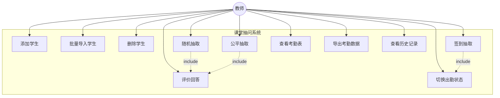
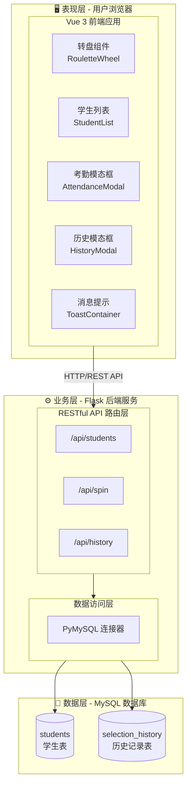
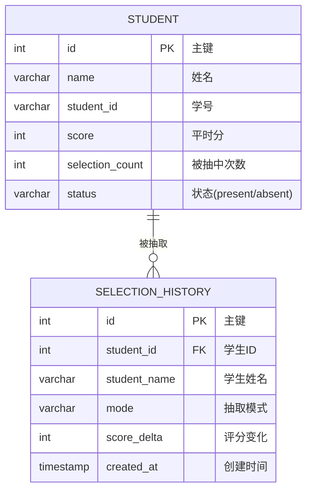
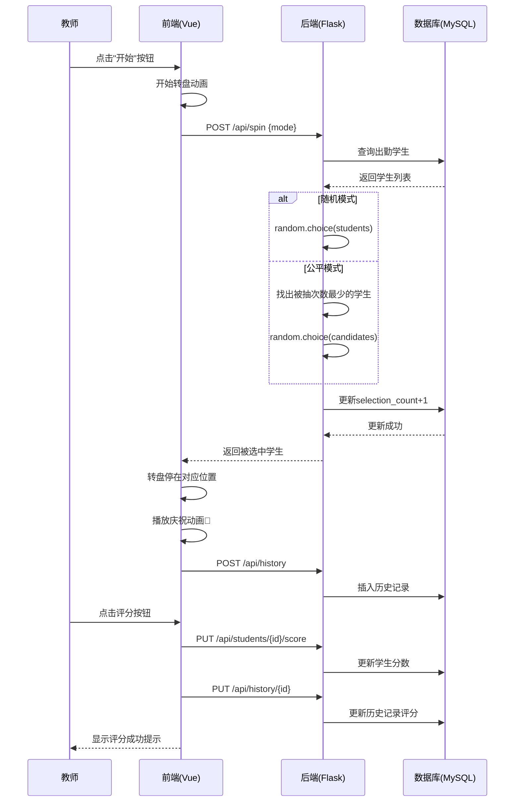
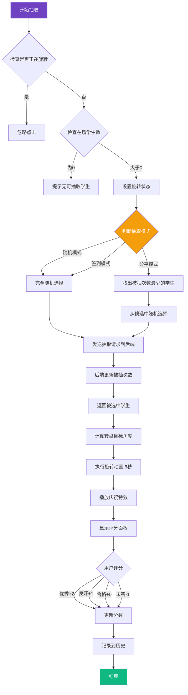
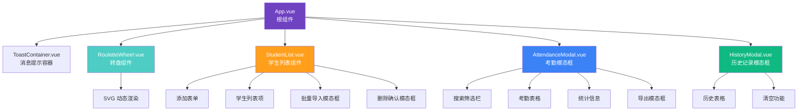

# 软件工程综合实验报告

## "智问"——课堂抽问系统

---

| 项目信息 |  |
|---------|---------|
| 项目名称 | 智问——课堂抽问系统 |
| 学生姓名 | （请填写） |
| 学号 | （请填写） |
| 专业班级 | （请填写） |
| 指导教师 | （请填写） |
| 完成日期 | 2025年12月 |

---

## 目录

1. [项目概述](#1-项目概述)
2. [需求分析](#2-需求分析)
3. [系统设计](#3-系统设计)
4. [系统实现](#4-系统实现)
5. [系统测试](#5-系统测试)
6. [总结与展望](#6-总结与展望)

---

## 1. 项目概述

### 1.1 项目背景

在传统课堂教学中，教师进行课堂提问时往往采用随机点名或按座位顺序提问的方式，这种方式存在以下问题：

1. **公平性不足**：部分学生可能被频繁抽中，而另一些学生则很少被提问
2. **效率低下**：手动点名耗时，影响课堂节奏
3. **记录困难**：缺乏对学生回答情况的系统化记录和统计
4. **考勤管理分散**：考勤与课堂互动分离，增加教师工作量

为解决上述问题，本项目设计并实现了"智问"课堂抽问系统，通过信息化手段提升课堂互动效率和公平性。

### 1.2 项目目标

- 实现随机/公平两种抽问模式，确保课堂提问的公平性
- 提供可视化的转盘抽取界面，增强课堂趣味性
- 集成考勤签到功能，实现考勤与提问的统一管理
- 记录学生回答情况，支持平时分统计
- 支持历史记录查询和数据导出

### 1.3 技术选型

| 层次 | 技术栈 | 说明 |
|------|--------|------|
| 前端框架 | Vue 3 + Composition API | 现代化响应式框架 |
| 构建工具 | Vite 7 | 快速的前端构建工具 |
| 后端框架 | Flask (Python) | 轻量级Web框架 |
| 数据库 | MySQL | 关系型数据库 |
| 跨域处理 | Flask-CORS | 支持前后端分离 |
| 数据库驱动 | PyMySQL | Python MySQL客户端 |

---

## 2. 需求分析

### 2.1 功能性需求

#### 2.1.1 学生管理模块

| 功能编号 | 功能名称 | 功能描述 |
|----------|----------|----------|
| F-SM-01 | 添加学生 | 支持单个添加学生姓名 |
| F-SM-02 | 批量导入 | 支持按行导入学生名单，可包含学号 |
| F-SM-03 | 删除学生 | 支持删除单个学生或清空所有学生 |
| F-SM-04 | 学生列表 | 显示学生姓名、分数、被抽中次数 |

#### 2.1.2 抽问模块

| 功能编号 | 功能名称 | 功能描述 |
|----------|----------|----------|
| F-QS-01 | 随机模式 | 完全随机抽取，所有在场学生概率相等 |
| F-QS-02 | 公平模式 | 优先抽取被点名次数少的学生 |
| F-QS-03 | 签到模式 | 随机抽取学生进行签到确认 |
| F-QS-04 | 转盘动画 | 可视化转盘旋转动画效果 |
| F-QS-05 | 评分功能 | 对学生回答进行评分（优秀/良好/合格/未答） |

#### 2.1.3 考勤管理模块

| 功能编号 | 功能名称 | 功能描述 |
|----------|----------|----------|
| F-AM-01 | 考勤表查看 | 查看全班学生考勤状态 |
| F-AM-02 | 状态切换 | 一键切换出勤/缺席状态 |
| F-AM-03 | 搜索筛选 | 按姓名/学号搜索，按状态筛选 |
| F-AM-04 | 数据导出 | 导出考勤表为CSV文件 |
| F-AM-05 | 统计展示 | 显示应到、实到、缺席人数及出勤率 |

#### 2.1.4 历史记录模块

| 功能编号 | 功能名称 | 功能描述 |
|----------|----------|----------|
| F-HR-01 | 记录查看 | 查看抽取历史记录 |
| F-HR-02 | 记录信息 | 显示时间、学生、模式、评分结果 |
| F-HR-03 | 清空记录 | 支持清空所有历史记录 |

### 2.2 非功能性需求

| 需求类型 | 描述 |
|----------|------|
| 性能需求 | 转盘动画流畅，响应时间<500ms |
| 可用性需求 | 界面简洁美观，操作直观 |
| 兼容性需求 | 支持主流现代浏览器（Chrome、Firefox、Safari） |
| 可维护性需求 | 前后端分离，代码结构清晰 |

### 2.3 用例图



---

## 3. 系统设计

### 3.1 系统架构设计

本系统采用**前后端分离**的B/S架构：



### 3.2 数据库设计

#### 3.2.1 E-R图



#### 3.2.2 数据表结构

**students 表（学生信息表）**

| 字段名 | 类型 | 约束 | 说明 |
|--------|------|------|------|
| id | INT | PRIMARY KEY, AUTO_INCREMENT | 主键 |
| name | VARCHAR(100) | NOT NULL | 学生姓名 |
| student_id | VARCHAR(50) | - | 学号 |
| score | INT | DEFAULT 0 | 平时分 |
| selection_count | INT | DEFAULT 0 | 被抽中次数 |
| status | VARCHAR(20) | DEFAULT 'present' | 状态(present/absent) |

**selection_history 表（抽取历史表）**

| 字段名 | 类型 | 约束 | 说明 |
|--------|------|------|------|
| id | INT | PRIMARY KEY, AUTO_INCREMENT | 主键 |
| student_id | INT | - | 学生ID |
| student_name | VARCHAR(100) | - | 学生姓名 |
| mode | VARCHAR(20) | - | 抽取模式 |
| score_delta | INT | - | 评分变化 |
| created_at | TIMESTAMP | DEFAULT CURRENT_TIMESTAMP | 创建时间 |

### 3.3 抽取流程时序图



### 3.4 抽取逻辑流程图



### 3.5 API接口设计

| 方法 | 路径 | 功能 | 请求参数 | 返回值 |
|------|------|------|----------|--------|
| GET | /api/students | 获取学生列表 | - | 学生数组 |
| POST | /api/students | 添加学生 | {name, student_id} | 成功消息 |
| POST | /api/students/batch | 批量添加 | {students: []} | 成功消息 |
| DELETE | /api/students/{id} | 删除学生 | - | 成功消息 |
| DELETE | /api/students/all | 清空学生 | - | 成功消息 |
| PUT | /api/students/{id}/status | 更新状态 | {status} | 成功消息 |
| PUT | /api/students/{id}/score | 更新分数 | {delta} | 成功消息 |
| POST | /api/spin | 抽取学生 | {mode} | 被抽中学生 |
| GET | /api/history | 获取历史 | - | 历史记录数组 |
| POST | /api/history | 添加历史 | {student_id, student_name, mode, score_delta} | 成功消息 |
| DELETE | /api/history | 清空历史 | - | 成功消息 |

### 3.6 前端组件设计



---

## 4. 系统实现

### 4.1 前端实现

#### 4.1.1 转盘组件核心代码

转盘采用SVG动态渲染，根据学生数量自动计算扇形角度：

```javascript
// 计算扇形路径
const getSectorPath = (startAngle, endAngle) => {
  const start = polarToCartesian(center, center, radius, endAngle)
  const end = polarToCartesian(center, center, radius, startAngle)
  const largeArcFlag = endAngle - startAngle <= 180 ? '0' : '1'
  return [
    'M', center, center,
    'L', start.x, start.y,
    'A', radius, radius, 0, largeArcFlag, 0, end.x, end.y,
    'Z'
  ].join(' ')
}

// 旋转动画控制
const spinTo = (index) => {
  const count = props.candidates.length
  const anglePerItem = 360 / count
  const segmentCenter = (index + 0.5) * anglePerItem
  const extraSpins = 8 * 360  // 额外旋转8圈
  currentRotation.value += diff + extraSpins
}
```

动画效果通过CSS transition实现：

```css
transition: transform 6s cubic-bezier(0.2, 0.8, 0.1, 1);
```

#### 4.1.2 抽取模式实现

```javascript
// 随机模式：完全随机选择
if (mode === 'random') {
  selected = random.choice(students)
}

// 公平模式：优先选择被抽中次数少的学生
if (mode === 'fair') {
  min_count = min([s.selection_count for s in students])
  candidates = [s for s in students if s.selection_count == min_count]
  selected = random.choice(candidates)
}
```

#### 4.1.3 考勤导出功能

```javascript
const exportToCSV = () => {
  const cols = Object.keys(exportColumns.value).filter(k => exportColumns.value[k])
  let csvContent = '\uFEFF' + cols.map(c => columnLabels[c]).join(',') + '\n'
  
  displayedStudents.value.forEach(s => {
    const row = cols.map(c => {
      if (c === 'status') return s.status === 'absent' ? '缺席' : '出勤'
      return s[c]
    })
    csvContent += row.join(',') + '\n'
  })
  
  // 创建Blob并下载
  const blob = new Blob([csvContent], { type: 'text/csv;charset=utf-8;' })
  const url = URL.createObjectURL(blob)
  // ... 下载逻辑
}
```

### 4.2 后端实现

#### 4.2.1 数据库连接

```python
MYSQL_CONFIG = {
    'host': '127.0.0.1',
    'user': 'root',
    'password': '******',
    'database': 'classroom_system',
    'charset': 'utf8mb4',
    'cursorclass': pymysql.cursors.DictCursor
}

def get_db_connection():
    conn = pymysql.connect(**MYSQL_CONFIG)
    return conn
```

#### 4.2.2 抽取接口实现

```python
@app.route('/api/spin', methods=['POST'])
def spin_wheel():
    mode = request.json.get('mode', 'random')
    conn = get_db_connection()
    cursor = conn.cursor()
    
    # 只选择出勤学生
    cursor.execute("SELECT * FROM students WHERE status = 'present'")
    students = cursor.fetchall()
    
    if mode == 'random':
        selected = random.choice(students)
    elif mode == 'fair':
        min_count = min([s['selection_count'] for s in students])
        candidates = [s for s in students if s['selection_count'] == min_count]
        selected = random.choice(candidates)
    
    # 更新被抽中次数
    cursor.execute('UPDATE students SET selection_count = selection_count + 1 WHERE id = %s', 
                   (selected['id'],))
    conn.commit()
    
    return jsonify(selected)
```

### 4.3 系统界面展示

#### 主界面布局

系统主界面分为两个区域：

1. **左侧转盘区域**：展示可视化转盘，点击中心按钮开始抽取
2. **右侧控制区域**：包含模式切换、考勤表、历史记录入口和学生列表

#### 界面特色

- **玻璃拟态设计**：采用毛玻璃效果，现代感强
- **渐变色主题**：紫色渐变主色调，视觉舒适
- **动画效果**：转盘旋转、模态框弹出均有流畅动画
- **响应式布局**：适配不同屏幕尺寸

---

## 5. 系统测试

### 5.1 功能测试

| 测试用例 | 测试步骤 | 预期结果 | 实际结果 | 状态 |
|----------|----------|----------|----------|------|
| 添加学生 | 输入姓名，点击添加 | 列表显示新学生 | 符合预期 | ✅ |
| 批量导入 | 粘贴多行姓名，确认导入 | 所有学生添加成功 | 符合预期 | ✅ |
| 随机抽取 | 点击开始按钮 | 转盘旋转后选中一名学生 | 符合预期 | ✅ |
| 公平抽取 | 切换公平模式后抽取 | 优先选中次数少的学生 | 符合预期 | ✅ |
| 评分功能 | 抽取后点击评分按钮 | 学生分数更新 | 符合预期 | ✅ |
| 考勤切换 | 点击学生状态复选框 | 状态在出勤/缺席间切换 | 符合预期 | ✅ |
| 历史记录 | 打开历史记录模态框 | 显示所有抽取记录 | 符合预期 | ✅ |
| 导出CSV | 点击导出按钮 | 下载考勤表文件 | 符合预期 | ✅ |

### 5.2 性能测试

| 测试项目 | 测试条件 | 性能指标 | 测试结果 |
|----------|----------|----------|----------|
| 页面加载 | 首次访问 | <2s | 约1.2s ✅ |
| API响应 | 获取学生列表(50人) | <500ms | 约80ms ✅ |
| 转盘动画 | 60fps流畅度 | 无卡顿 | 流畅 ✅ |
| 批量导入 | 导入100名学生 | <3s | 约1.5s ✅ |

### 5.3 兼容性测试

| 浏览器 | 版本 | 测试结果 |
|--------|------|----------|
| Chrome | 120+ | ✅ 完全兼容 |
| Firefox | 120+ | ✅ 完全兼容 |
| Safari | 17+ | ✅ 完全兼容 |
| Edge | 120+ | ✅ 完全兼容 |

---

## 6. 总结与展望

### 6.1 项目总结

本项目成功设计并实现了"智问"课堂抽问系统，主要完成了以下工作：

1. **完成了需求分析**：明确了系统的功能性和非功能性需求
2. **设计了系统架构**：采用前后端分离的B/S架构
3. **实现了核心功能**：
   - 可视化转盘抽取
   - 随机/公平/签到三种模式
   - 学生管理与批量导入
   - 考勤管理与数据导出
   - 历史记录追踪
4. **完成了系统测试**：功能、性能、兼容性测试均通过

### 6.2 项目特色

1. **用户体验优秀**：转盘动画生动有趣，增强课堂互动性
2. **功能实用完整**：覆盖课堂提问、考勤、评分全流程
3. **技术栈现代化**：Vue 3 + Vite + Flask，代码质量高
4. **界面设计精美**：玻璃拟态风格，视觉效果出色

### 6.3 不足与改进方向

| 现有不足 | 改进方向 |
|----------|----------|
| 单机部署 | 支持云端部署，多教室共用 |
| 无用户认证 | 增加教师登录功能 |
| 数据备份手动 | 自动定期备份 |
| 仅支持Web | 开发移动端App |

### 6.4 学习收获

通过本项目的开发，我掌握了：

1. **Vue 3 Composition API** 的使用方法
2. **Flask RESTful API** 的设计与实现
3. **前后端分离**架构的开发模式
4. **MySQL数据库**的设计与操作
5. **软件工程**的规范化开发流程

---

## 附录

### A. 项目目录结构

```
课程抽问系统/
├── backend/
│   ├── app.py              # Flask后端主程序
│   ├── requirements.txt    # Python依赖
│   └── venv/               # 虚拟环境
├── frontend/
│   ├── src/
│   │   ├── App.vue         # 主组件
│   │   ├── components/     # 子组件
│   │   │   ├── RouletteWheel.vue
│   │   │   ├── StudentList.vue
│   │   │   ├── AttendanceModal.vue
│   │   │   ├── HistoryModal.vue
│   │   │   └── ToastContainer.vue
│   │   ├── utils/
│   │   │   └── confetti.js # 庆祝动画
│   │   └── main.js
│   ├── package.json
│   └── vite.config.js
└── README.md
```

### B. 运行说明

**启动后端：**
```bash
cd backend
source venv/bin/activate
python app.py
```

**启动前端：**
```bash
cd frontend
npm run dev
```

**访问地址：** http://localhost:5173

### C. 参考资料

1. Vue.js 3 官方文档 - https://vuejs.org/
2. Flask 官方文档 - https://flask.palletsprojects.com/
3. Vite 官方文档 - https://vitejs.dev/
4. PyMySQL 文档 - https://pymysql.readthedocs.io/

---

*本报告由课堂抽问系统项目组完成*

